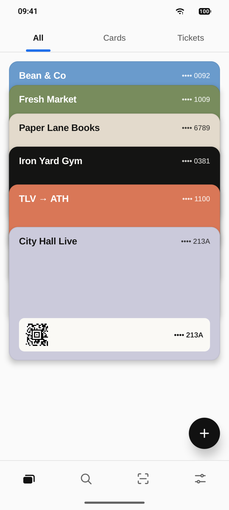
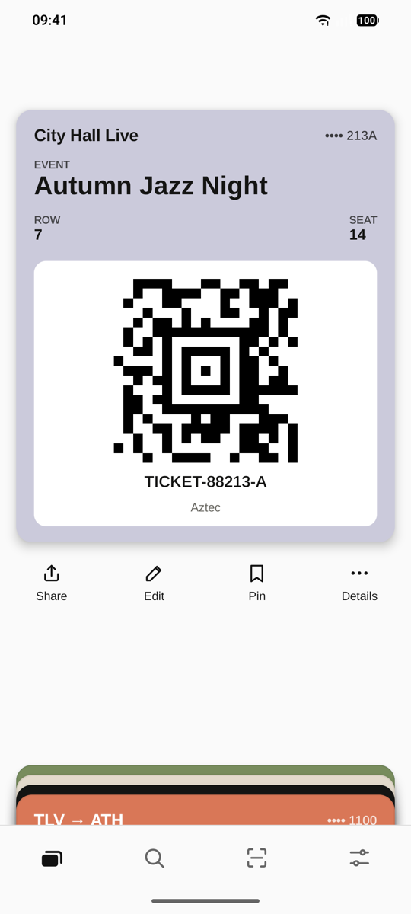
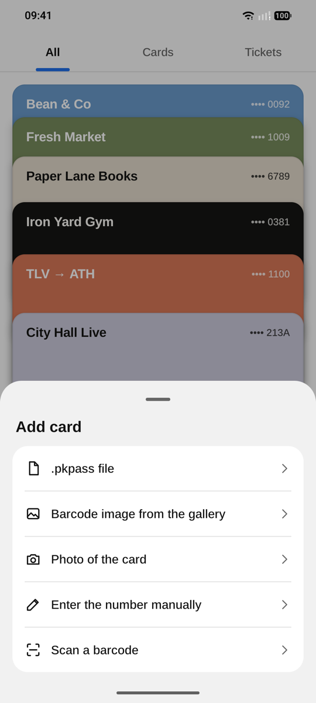
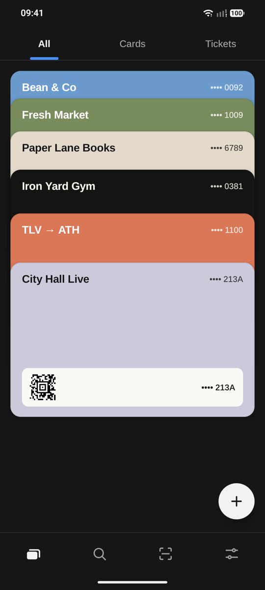

# stackd

Android wallet for Apple Wallet passes (`.pkpass`) and physical loyalty cards.
Physical cards are added by scanning their barcode with the camera, from a
photo, or by typing the number; passes arrive from mail, a browser or a file
manager. Android 16+ only. The interface speaks ten languages: English,
Belarusian, French, German, Hebrew, Italian, Polish, Russian, Serbian and
Spanish.

<p>
  
  
  
  
</p>

## Contents

- [Features](#features)
- [Stack](#stack)
- [Project layout](#project-layout)
- [Build](#build)
  - [Local build in Docker](#local-build-in-docker)
  - [Install on a phone](#install-on-a-phone)
- [Download](#download)
- [Design](#design)
- [License](#license)

## Features

- **Stack home screen** — cards overlap like a deck, ordered by the date they
  were added, the newest in front with its barcode visible. A card has the
  proportions of a real one (ISO/IEC 7810 ID-1). The deck fans out down the
  screen: cards sit tight under the top edge and wide apart at the bottom, so
  scrolling leafs through them; past the ends it stretches like a rubber band
  and springs back. Pinned cards form a second stack of their own below the
  rest. Tabs all / cards / tickets switch by swipe.
- **Cards open in place**, like Apple Wallet — a tapped card rises to the top
  and unfolds its fields and barcode, the rest drop into a pile at the bottom.
  A tap on the card or the pile, a drag down or the (predictive) back gesture
  folds it back into its slot. Under the open card: share, update, edit,
  pin, and details (back fields, dates, delete) in a bottom sheet.
- **Scanner** — live barcode detection only (CameraX + ML Kit, bundled
  model, works offline); it slides up over the app and back down on the back
  gesture.
- **Add (+)** — a sheet with every source: `.pkpass` file, barcode search in
  a gallery image, a photo of the card that becomes its cover, manual entry,
  and the scanner.
- **`.pkpass` import** — opens `application/vnd.apple.pkpass` (and
  `.pkpasses` bundles) from other apps. Parses `pass.json` (as leniently as
  Wallet: trailing commas and comments are accepted), `*.lproj`
  localisation, colours, images and all field sections. Re-importing the same
  pass (`passTypeIdentifier` + `serialNumber`) updates it in place. The Apple
  signature is not verified — passes are only displayed.
- **Pass updates** — a pass that names a web service (`webServiceURL` +
  `authenticationToken`) can be refreshed: the *Update* button under the
  open card, or automatically every 1–24 h (off by default, Settings). A
  notification comes for the fields the issuer marks with `changeMessage`,
  as iOS does; *Notify about any change* adds the other fields on the front,
  dates aside. It is Apple's PassKit web service
  `GET …/v1/passes/{type}/{serial}`, https only; issuers cannot push to
  Android, so the app polls.
- **App updates** — a tap on *Version* in Settings asks GitHub for the latest
  release, shows what changed and can download the APK and pass it to the
  system installer, which checks the signature and asks for confirmation. A
  weekly background check with a notification is off by default. Pass
  updates and this check are the only network traffic.
- **Backup** — *Save a backup* in Settings writes every card, the stored
  passes with their images, the cover photos and the settings into one
  `.stackd` file wherever the system file picker lets you put it. With a
  password the file is encrypted (AES-256-GCM, key from PBKDF2); without
  one it is a plain zip. *Restore from a backup* adds the cards of a file to
  the ones in the app; *Replace what is already here* decides whether a card
  that exists in both, and the settings, are taken from the file. The same
  data is also part of Android's own backup to the Google account, when
  that is turned on in the system.
- **Barcodes** are drawn with ZXing; while a card is open the screen stays on
  and its brightness goes to maximum (configurable). Share sends the original
  `.pkpass` or the number.
- **Languages** — English (default), Belarusian, German, Spanish, French,
  Italian, Polish, Russian, Serbian (Cyrillic) and Hebrew (right-to-left). Pick one in Settings or in the
  system *Settings → Apps → Stackd → App language*; both share one value.
- **Look** — light, dark or system theme, and two colour schemes: the neutral
  classic default with a blue accent and a warm one.
- Search by name, number or note.

## Stack

| Area | Choice |
|---|---|
| Language / build | Kotlin 2.4, AGP 9.4 (built-in Kotlin), Gradle 9.8, JDK 25 |
| SDK | `minSdk 36` (Android 16), `compileSdk`/`targetSdk 37` |
| UI | Jetpack Compose (BOM 2026.09), Material 3, Navigation 3 |
| Storage | Room 3 with the bundled SQLite driver, DataStore |
| Camera | CameraX 1.6 (`camera-compose` viewfinder, `camera-mlkit-vision`) |
| Barcodes | ML Kit barcode scanning (bundled) to read, ZXing core to draw |

All versions live in [`gradle/libs.versions.toml`](gradle/libs.versions.toml).

## Project layout

```
app/src/main/kotlin/dev/glowcow/stackd/
  barcode/   formats, ZXing renderer, ML Kit mapping and still-image scan
  pkpass/    .pkpass parser (pure JVM, unit-tested), .strings parser, importer
  update/    pass refresh from the issuer and app self-update, background
             jobs, notifications
  backup/    the backup archive, its password encryption, save and restore
  data/      Room entity/DAO/database, repository, stack ordering, settings
  ui/        theme + icons, shared components, one package per screen
             (home/Wallet.kt: the deck, scrolling and the in-place open card)
app/src/test/  parser, update and backup tests
```

## Build

The host needs only Docker: JDK, Android SDK and the Gradle distribution live
in the `glowcow/android-sdk` image on Docker Hub (tag =
`<build-tools>-gradle<gradle>`), so a build downloads only the app's own
dependencies. Keep the tag in step with `buildToolsVersion` and the Gradle
wrapper.
The build runs as `linux/amd64` (Google ships `aapt2` for x86-64 Linux only).
On Apple Silicon turn on *Use Rosetta for x86_64/amd64 emulation* in Docker
Desktop and give the VM ~12 GB of memory: a warm debug build then takes
~1 min and a release (R8) build ~3.5 min, against ~35 min under QEMU.

### Local build in Docker

Run Gradle in the toolchain image with the sources mounted and a persistent
dependency cache:

```sh
IMAGE=glowcow/android-sdk:37.0.0-gradle9.8.0
RUN="docker run --rm --platform linux/amd64 -v $PWD:/src -v stackd-gradle:/root/.gradle/caches -v stackd-keys:/root/.android $IMAGE"

# debug APKs + unit tests
$RUN ./gradlew testDebugUnitTest assembleDebug

# lint + release APKs, unsigned; -PappVersion sets the version
$RUN ./gradlew -PappVersion=0.1.0 lintRelease assembleRelease
```

The APKs land in `app/build/outputs/apk/<type>/`, one per ABI:
`app-arm64-v8a-<type>.apk` for phones and `app-x86_64-<type>.apk` for the
emulator. The `stackd-keys` volume keeps the debug keystore, so a rebuilt
debug APK installs over the previous one.

### Install on a phone

Enable *Developer options → Wireless debugging* on the phone, then use `adb`
from the same image (the volume keeps the adb pairing keys):

```sh
docker run --rm -it --platform linux/amd64 -v stackd-adb:/root/.android -v "$PWD/app/build/outputs/apk":/apk \
  glowcow/android-sdk:37.0.0-gradle9.8.0 sh -c 'adb pair <ip>:<pair-port> && adb connect <ip>:<port> && adb install -r /apk/debug/app-arm64-v8a-debug.apk'
```

Or copy the APK to the phone and open it.

The same container reads crashes (`adb logcat -b crash -d`) and frame stats
(`adb shell dumpsys gfxinfo <package>`). Judge animations on a release (R8)
build: debug Compose is several times slower.

## Download

Signed APKs are attached to every
[release](https://github.com/glowcow/stackd/releases). Phones take
`stackd-<version>-arm64-v8a-release.apk`; the `x86_64` one is for the
emulator. There is no store listing: allow your browser or file manager to
install apps, then open the file.

Releases are signed with the certificate `CN=Anton Sediuk, O=glowcow`,
SHA-256
`7E:63:EC:86:6B:13:A8:23:B4:1B:4F:07:05:75:50:13:8F:B6:65:C3:50:B8:0D:41:CF:CF:B2:19:CB:98:C5:67`.
Check a downloaded file with `apksigner verify --print-certs <file>.apk`.
Versions up to 0.3.2 were signed with an earlier key and have to be
uninstalled before installing a newer one.

## Design

Mockups and the launcher icon come from the `stackd-design` bundle. The
default *classic* scheme is neutral grey — light `#FAFAFA` / dark `#161616`
backgrounds, accent `#1F6FEB`; the *warm* scheme of the original design has
`#FAF9F5` / `#1A1A18` and accent `#D97757`. Card colours start from
`#6A9BCC #788C5D #CBCADB #E3DACC #BCD1CA #141413`. UI font: Arimo, which
covers every language of the app. The header and the tab bar are frosted
glass: the page scrolls under them and shows through, blurred.

## License

[GNU General Public License v3.0 or later](LICENSE) © Anton Sediuk. A
modified version you distribute has to stay open under the same licence.

As an additional permission under section 7 of the GPL, the app may be
combined and distributed with Google's ML Kit barcode scanning library, which
is not free software.

Arimo is bundled under the SIL Open Font License 1.1 — see
[`licenses/Arimo-OFL.txt`](licenses/Arimo-OFL.txt).
